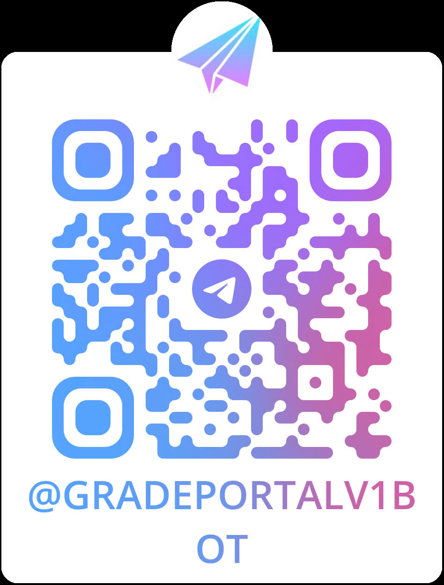

   

  
  <h1 align="center"> Grade-Portal-Tele (Module Telegram Bot Tra cứu điểm)</h1>

## Giới thiệu
Dự án này là một phần của hệ thống lớn: **Xây dựng hệ thống tra cứu điểm** cho sinh viên trường Đại học Bách khoa - Đại học Quốc gia TP.HCM. Đây là module xây dựng một Telegram bot nhằm cung cấp phương thức nhanh chóng và tiện lợi để tra cứu điểm số.

## Mục tiêu của dự án
- Tạo ra một phương thức tra cứu điểm mới, giải quyết nhu cầu nhận điểm sớm của sinh viên sau mỗi kỳ kiểm tra.
- Cung cấp kênh chính thống giúp sinh viên quản lý điểm quá trình, hỗ trợ lập kế hoạch học tập.
- Trở thành một kênh tiện ích dễ sử dụng cho sinh viên, với giao diện đơn giản trên Telegram.

## Tính năng chính
- **Tra cứu điểm số:** Cung cấp các câu lệnh đơn giản, dễ dàng sử dụng để tra cứu và hiển thị điểm số cô đọng nhưng đầy đủ.
- **Theo dõi chi tiết:** Sinh viên có thể xem điểm của từng môn (bao gồm điểm thành phần, điểm kiểm tra, điểm thi) ngay cả khi hệ thống chính thức chưa cập nhật kịp thời.
- **Cập nhật nhanh chóng:** Giúp sinh viên theo dõi điểm số một cách nhanh nhất sau mỗi kỳ kiểm tra.

## Thông tin về nhóm
Hệ thống quản lý điểm bao gồm 5 nhóm tham gia phát triển. Nhóm của chúng tôi tên là **"Tây Tiến đoàn binh không mọc tóc"**, với 5 thành viên đóng vai trò chính như sau:

| STT | Tên thành viên           | Vai trò         | Mã số sinh viên | Email                                                     | GitHub                                       |
|-----|--------------------------|-----------------|-----------------|-----------------------------------------------------------|----------------------------------------------|
| 1   | Nguyễn Lê Hoàng Phúc     | Product Owner   | 2212629         | [phuc.nguyenlehoang707@hcmut.edu.vn](mailto:phuc.nguyenlehoang707@hcmut.edu.vn) | [Huangfu1204](https://github.com/Huangfu1204) |
| 2   | Đặng Quốc Phong          | Developer       | 2212548         | [phong.dang2212548@hcmut.edu.vn](mailto:phong.dang2212548@hcmut.edu.vn)         | [phongdang17183](https://github.com/phongdang17183) |
| 3   | Lê Vĩnh Nghiệp           | Developer       | 2212213         | [nghiep.lekhmtk22@hcmut.edu.vn](mailto:nghiep.lekhmtk22@hcmut.edu.vn)           | [vinhnghiep0811](https://github.com/vinhnghiep0811) |
| 4   | Trần Minh Quân           | Developer       | 2212823         | [tran.minhquan1221@hcmut.edu.vn](mailto:tran.minhquan1221@hcmut.edu.vn)         | [Dopalan](https://github.com/Dopalan)         |
| 5   | Trần Thanh Phong         | Developer       | 2212571         | [phong.dang2212548@hcmut.edu.vn](mailto:phong.dang2212548@hcmut.edu.vn)         | [Rabbit-204](https://github.com/rabbit-204)   |
| 6   | Trương Anh Tuấn          | Developer       | 2212571         | [tuan.truong2t00nas4@hcmut.edu.vn](mailto:tuan.truong2t00nas4@hcmut.edu.vn)     | [tuntrng](https://github.com/tuntrng)         |

## Hướng dẫn cài đặt (dành cho nhà phát triển)

### 1. Clone dự án

Sao chép mã nguồn từ GitHub:

`git clone https://github.com/dath-241/grade-portal-tele.git` 

### 2. Mở dự án
-   Mở thư mục `grade-portal-tele` trong Visual Studio Code (hoặc bất kỳ IDE/Editor nào bạn sử dụng).
-   Điều hướng đến thư mục `source`:   `cd grade-portal-tele/source` 
    

### 3. Tạo file cấu hình `.env`

Trong thư mục `source`, tạo một file `.env` với nội dung:

`TOKEN=<TOKEN CỦA BOT> ` 

`API_URL=<LINK API BACKEND DATABASE>`

> **Lưu ý:**
> -   **TOKEN**: Tạo token riêng từ BotFather nếu bạn muốn tạo bot của riêng mình.
> -   **API_URL**: Địa chỉ API của backend database.

### 4. Chạy ứng dụng
Sử dụng Go để khởi chạy bot:

`go run main.go` 

Bot sẽ bắt đầu hoạt động và bạn có thể thử nghiệm bằng cách gửi tin nhắn qua Telegram.

----------

## Sử dụng bot đã triển khai (không cần cài đặt)

Nhóm đã triển khai bot và bạn có thể sử dụng trực tiếp mà không cần cài đặt.

-   **Truy cập bot tại**: [Grade Portal v1 Bot](https://t.me/Gradeportalv1BOT)
-   **Quét mã QR để truy cập nhanh:** 

  

----------

## Yêu cầu hệ thống

-   **Go**: Phiên bản >= 1.18
-   **Telegram Account**: Để tương tác với bot.
-   **Backend API**: Đảm bảo API database backend hoạt động đúng địa chỉ cung cấp trong file `.env`.

## Liên hệ
Nếu bạn có bất kỳ thắc mắc nào về dự án hoặc muốn đóng góp, vui lòng liên hệ với nhóm qua email của các thành viên hoặc các kênh liên lạc khác (*sẽ được cập nhật*).

## Quá trình hoạt động
- Biên bản họp nhóm nội bộ được diễn ra với tần suất 1 lần/1 tuần.
- Đây là tổng hợp các biên bản họp nhóm: [Tổng hợp biên bản họp nhóm](https://www.canva.com/design/DAGS_GR8W7c/3DhbcAFdo0-Ls1OseWj3og/view?utm_content=DAGS_GR8W7c&utm_campaign=designshare&utm_medium=link&utm_source=editor)

---

> *README này sẽ được cập nhật thường xuyên để cung cấp thêm thông tin chi tiết và hướng dẫn sử dụng.*
